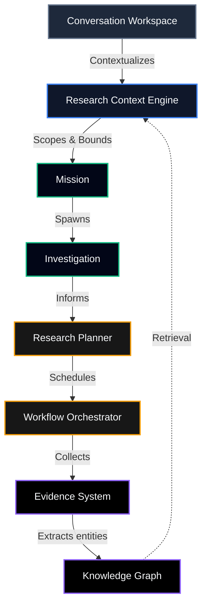

# Argus Architecture

The following diagram maps the core architecture of the Argus conversational AI and research orchestration system as stabilized in Sprint 13.

## Core Components
- **Conversation Workspace**: The user interface for interacting with Argus. Handles persistent messaging and multimodal evidence integration.
- **Research Context Engine**: Bridges conversations and missions by synthesizing conversation context, active scopes, and historical graph data.
- **Mission**: The central entity representing a scoped research effort, bounding all activity by authorization policies and target constraints.
- **Investigation**: Tracked hypotheses and objectives within a specific mission.
- **Research Planner**: Intelligence component that decides what steps to take to resolve investigations based on the current context.
- **Workflow Orchestrator**: Executes scheduled workflows and agent tasks based on the research plan, capturing stdout/stderr and raw artifacts.
- **Evidence System**: Manages multimodal artifacts, screenshots, and logs, preserving lineage from orchestrator workflows.
- **Knowledge Graph**: The unified intelligence layer mapping targets, workflows, business objects, endpoints, and relationships.
